# Book Publisher

A full-stack book management application built with .NET 10 and React 19. Features public book catalog browsing, authenticated user book interactions (favorites, ratings, reading status), and a comprehensive admin panel for managing books, authors, artists, and users.

## Screenshots Gallery

> A visual tour of the Book Publisher application

### Public & Guest Experience

| Start Page | View Book (Guest) |
|:----------:|:-----------------:|
| 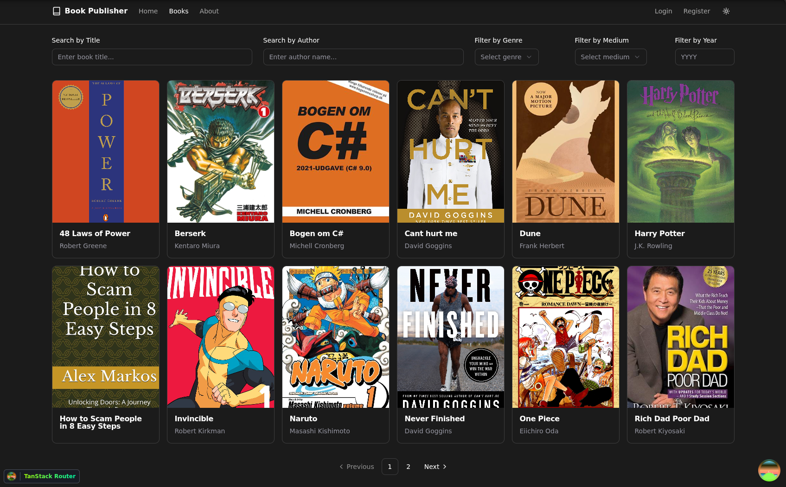 |  |

### User Experience

| View Book (Authenticated) | Edit Profile | My Book Interactions |
|:-------------------------:|:------------:|:--------------------:|
|  | 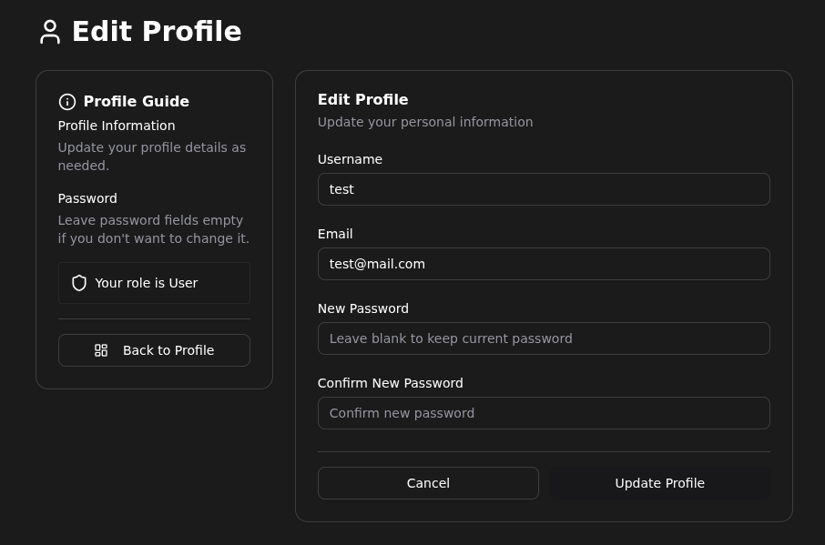 | 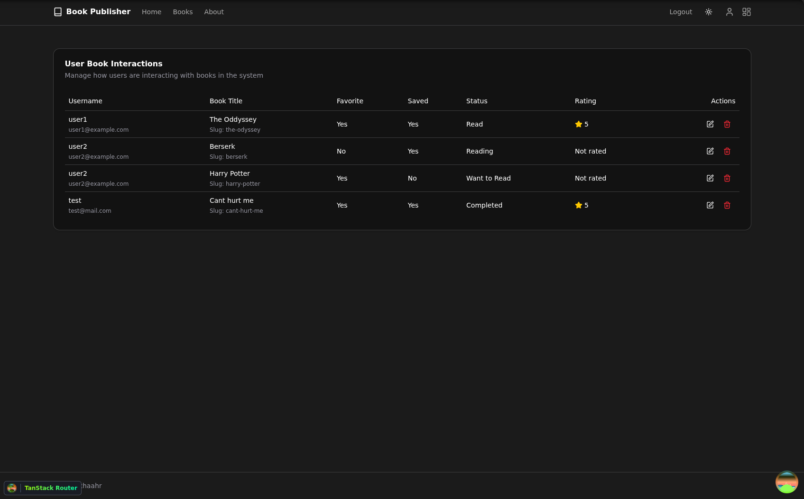 |
| | | 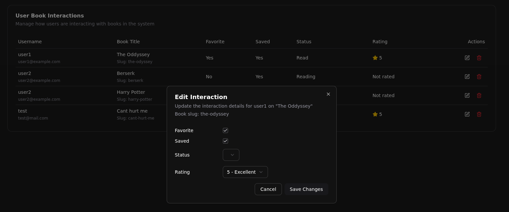 |

### Admin Dashboard

<p align="center">
  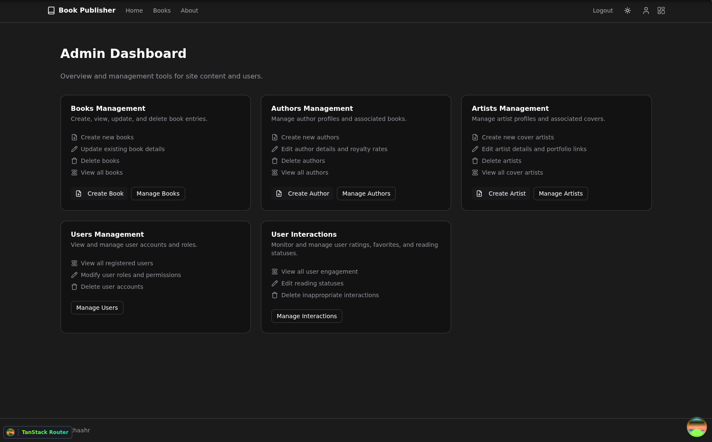
</p>

### Content Management

#### Books
| Manage Books | Create Book | Edit Book |
|:------------:|:-----------:|:---------:|
| 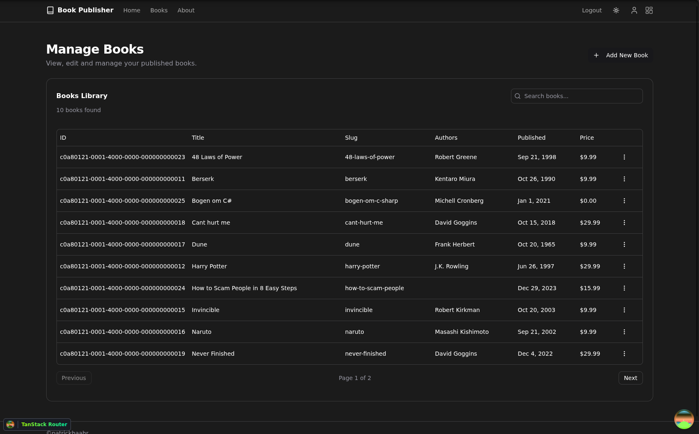 | 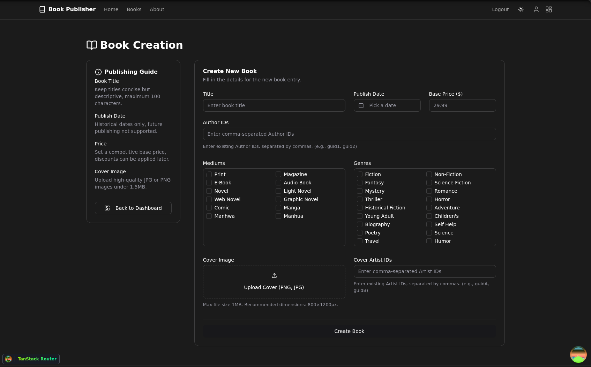 | 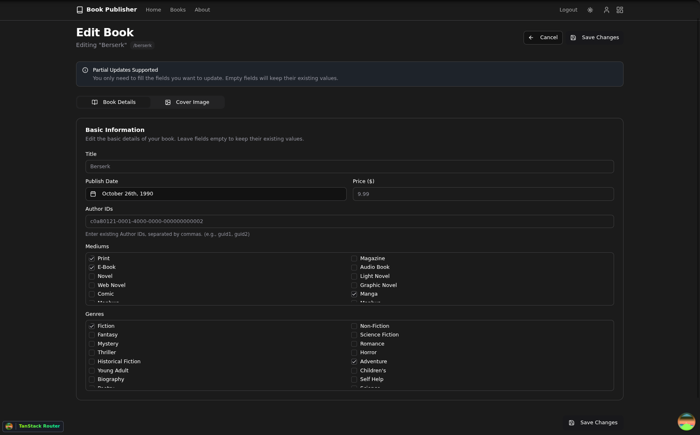 |

#### Authors
| Manage Authors | Create Author | Edit Author |
|:--------------:|:-------------:|:-----------:|
| 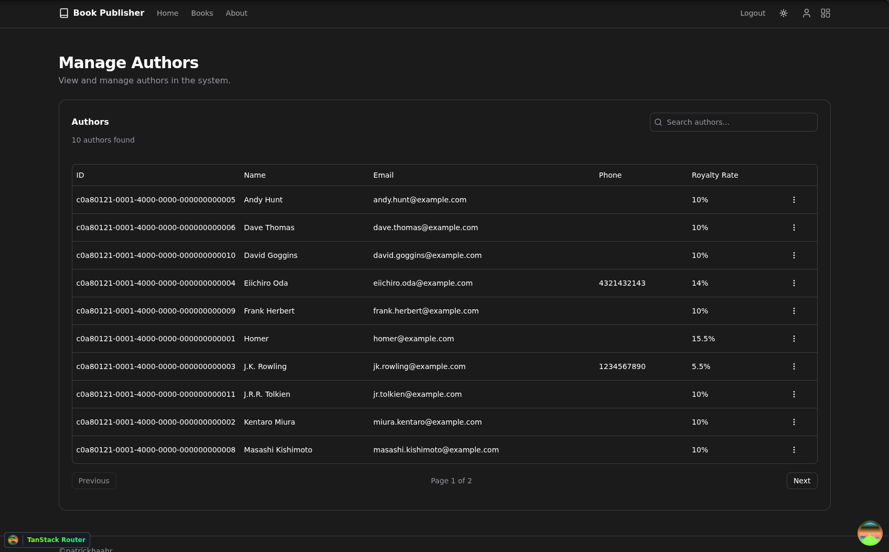 | 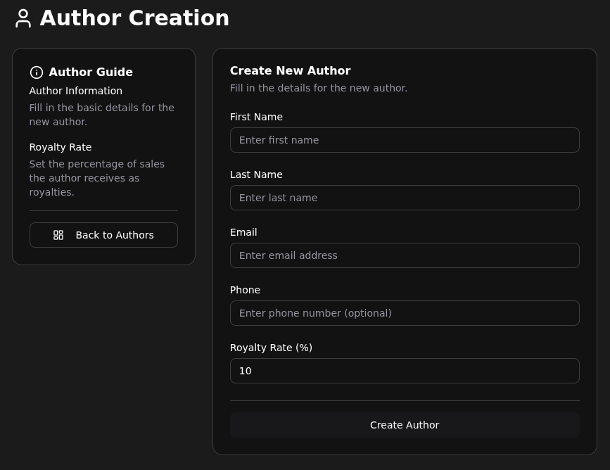 | 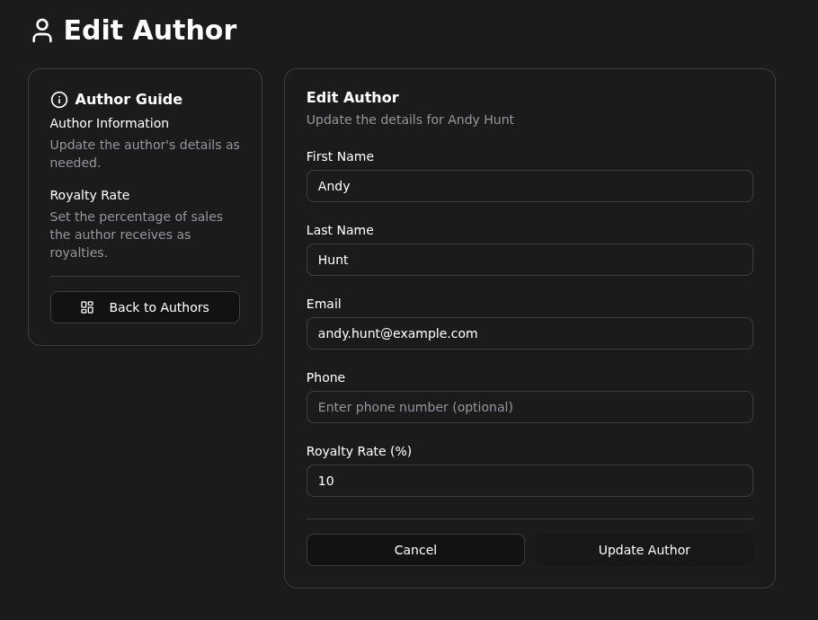 |

#### Artists
| Manage Artists | Create Artist | Edit Artist |
|:--------------:|:-------------:|:-----------:|
| 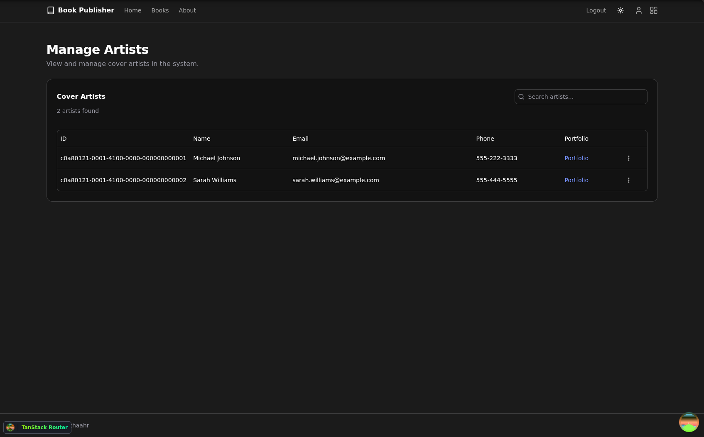 | 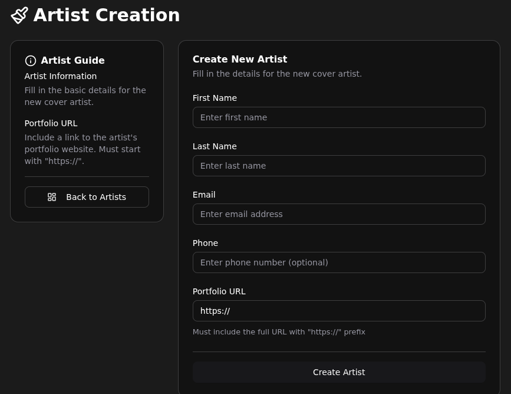 |  |

### User Management

| Manage Users | Edit User Role |
|:------------:|:--------------:|
| 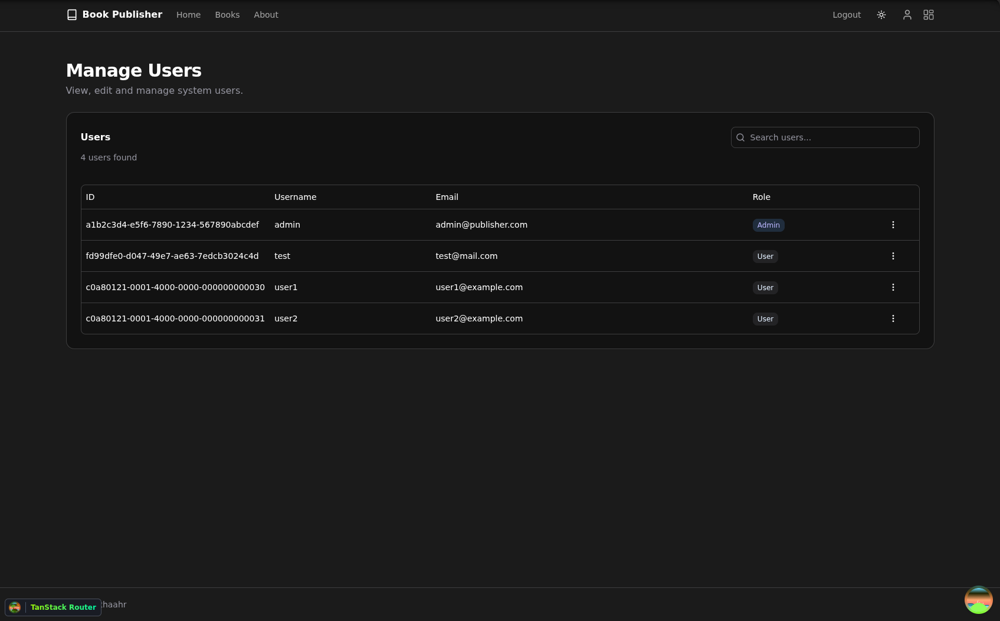 | 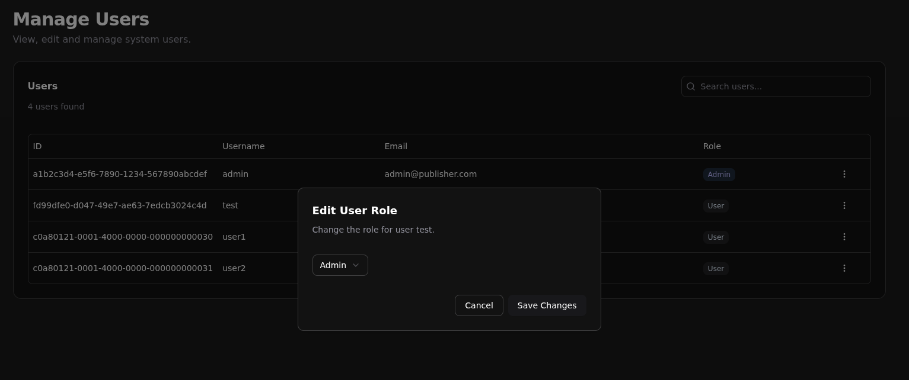 |

---

## Backend Architecture

### Overview
The backend is a .NET 10 ASP.NET Core Web API split into five Clean Architecture projects under `backend/src`:
- **Presentation** — startup, middleware, auth attributes, controllers
- **Application** — CQRS handlers, validators, repository interfaces
- **Infrastructure** — EF Core `AppDbContext`, entity configuration, repository implementations, auth services
- **Domain** — entities, enums, domain exceptions
- **Contracts** — request/response DTOs

### Runtime Pipeline
`Program.cs` wires Application and Infrastructure services, then applies CORS, custom exception middleware, health checks, authentication, authorization, and controllers. Requests flow through MediatR + FluentValidation pipeline behaviors before reaching handlers and repositories.

### Database & EF Core
- **SQL Server** via EF Core with code-first migrations.
- **TPH inheritance**: `Person` is the base table for `Author` and `Artist`.
- **Seeded lookups**: `Genre` and `Medium` enums seed their own tables.
- **Migration seeding**: the initial migration seeds 16 books, 15 authors, 2 artists, 3 users (including an admin), 3 user-book interactions, and related links (covers, book-genres, book-mediums, book-persons, cover-persons).
- Covers store base64 image content directly in the database.

<p align="center">
  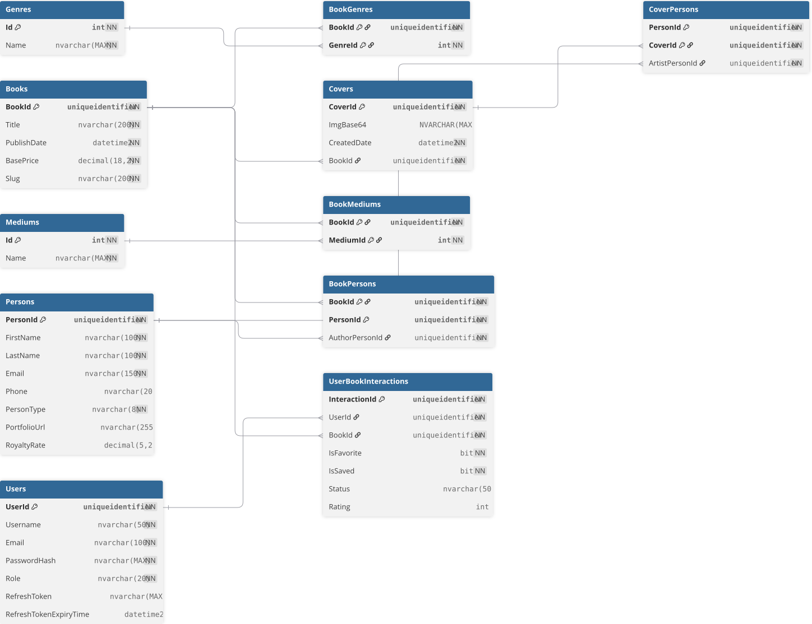
</p>

### Authentication & Authorization
- **Local JWT auth**: register, login, logout, and refresh-token endpoints issue JWT access tokens and refresh tokens. Passwords are hashed with ASP.NET Identity `PasswordHasher<User>`.
- **Role claims**: JWTs emit `sub`, `name`, `email`, and `role`. Admin-only endpoints require the `Admin` role via a custom `JwtAdminAttribute`.
- **Entra ID**: Microsoft Identity Web API is registered in DI, but there is no Entra login/callback endpoint; protected controllers currently force the local JWT scheme.

### API Versioning & Endpoints
All implemented routes live under `/api/v1`. There are ~40 implemented endpoints across:
- **Books** (public read; admin create/update/delete)
- **Authors** (admin CRUD)
- **Artists** (admin CRUD)
- **Covers** (admin CRUD)
- **Users** (admin list/update-role/delete; authenticated get/update)
- **User-book interactions** (authenticated CRUD + lookup by user and book)
- **Auth** (public register/login/refresh; authenticated logout)
- **Health** (public `/health`) and an Azure Functions proxy

### Pagination, Filtering & Sorting
- **Books**: paginated list with filters for title, author, genre, medium, and year; fixed `Title ASC` sort.
- **Authors / Artists / Users**: paginated lists with fixed alphabetical sort; no effective search/filter.
- **Covers & interactions**: no pagination or sorting.

### Cross-cutting Concerns
- **Global exception middleware** maps FluentValidation, domain validation, and not-found cases into structured responses.
- **FluentValidation** runs for books, authors, artists, covers, users, interactions, and auth register.
- **JSON enum serialization** as strings and cycle ignoring.
- **CORS** policy restricted to `http://localhost:5173`.
- **Database health check** exposed at `/health`.
- **Max request body size** capped at 1 MB.

## Frontend Architecture

### Overview
The frontend is a single-page React 19 application bootstrapped with Vite and managed under the `frontend/` workspace.

### Technical Stack
- **React 19** with TypeScript
- **Vite** for build tooling and route-level code splitting
- **TanStack Router** for file-based routing
- **TanStack Query** for server-state caching and data fetching
- **TanStack Form** for form state in auth, profile, and admin flows
- **Tailwind CSS v4** + **shadcn/ui** (Radix primitives) for styling and components

### Notable Features & Behaviors
- **Dual authentication**: supports local JWT (stored in `localStorage`) and Microsoft Entra ID (MSAL popup login), with role extraction from JWT claims.
- **Debounced catalog search**: public book filtering uses a 300ms debounce (`use-debounce`) on title/author/year inputs to avoid excessive refetches.
- **Focus retention while filtering**: the books list attempts to keep focus on active filter inputs across re-renders.
- **Persisted theming**: theme preference is saved to `localStorage` (`book-publisher-theme`) and toggles `light`/`dark` classes on the document root.
- **Query caching strategy**: public books and book detail queries are cached with 5-minute `staleTime`/`gcTime`; user-book interactions use `staleTime: 0` to stay fresh.
- **Per-user book interactions**: authenticated JWT users can favorite, save, rate (1–5), and set reading status (`Reading`, `Completed`, `Want to Read`, `Dropped`) on book detail pages.
- **Admin CRUD & guards**: full admin management for books, authors, artists, users, and user-book interactions. Admin routes are client-side gated using JWT `Admin` claims, and the users screen prevents self-deletion and self-role editing.
- **Client-side validation**: auth, profile, and admin create/edit forms include inline validation (email regex, min lengths, required multi-selects, image size/type checks).
- **Accessibility**: built on Radix primitives with keyboard focus management, `aria-label`/`sr-only` annotations, and semantic nav/pagination roles.
- **Performance patterns**: lazy image loading on book cards, route code splitting, and dev-only TanStack Router + Query devtools.

## API Testing

Import the Postman collection from `/helpers/BookPublisher.postman_collection.json`. Set the `BASE_URL` environment variable to your API (e.g., `https://localhost:5001`).

---

## Project Structure

```text
.
├── backend/                          # .NET backend
│   ├── src/
│   │   ├── Publisher.Application/    # Application layer
│   │   │   ├── Artists/              # Artist-related use cases
│   │   │   │   ├── Commands/         # Create/update/delete artist workflows
│   │   │   │   └── Queries/          # Read/list artist workflows
│   │   │   ├── Authentication/       # Login, register, refresh, logout flows
│   │   │   │   ├── Commands/         # State-changing auth actions
│   │   │   │   └── Queries/          # Read/authentication lookup actions
│   │   │   ├── Authors/              # Author-related use cases
│   │   │   │   ├── Commands/         # Create/update/delete author workflows
│   │   │   │   └── Queries/          # Read/list author workflows
│   │   │   ├── Behaviors/            # Cross-cutting MediatR pipeline behavior
│   │   │   ├── Books/                # Book-related use cases
│   │   │   │   ├── Commands/         # Create/update/delete book workflows
│   │   │   │   └── Queries/          # Read/list/search book workflows
│   │   │   ├── Covers/               # Cover-related use cases
│   │   │   │   ├── Commands/         # Create/update/delete cover workflows
│   │   │   │   └── Queries/          # Read/list cover workflows
│   │   │   ├── Interfaces/           # Application-facing abstractions
│   │   │   │   ├── Authentication/   # Token/password service contracts
│   │   │   │   └── ...               # Repository and current-user contracts
│   │   │   ├── UserBookInteractions/ # User-to-book interaction use cases
│   │   │   │   ├── Commands/         # Create/update/delete interaction workflows
│   │   │   │   └── Queries/          # Fetch interactions by id/user/book
│   │   │   ├── Users/                # User management/admin use cases
│   │   │   │   ├── Commands/         # Update role/profile, delete user
│   │   │   │   └── Queries/          # Read/list user workflows
│   │   │   └── Utils/                # Shared application utilities/validation helpers
│   │   ├── Publisher.Contracts/      # API contracts
│   │   │   ├── Requests/             # Incoming request DTOs from clients
│   │   │   └── Responses/            # Outgoing response DTOs to clients
│   │   ├── Publisher.Domain/         # Core business model
│   │   │   ├── Entities/             # Domain entities and relationships
│   │   │   ├── Enums/                # Domain enums
│   │   │   └── Exceptions/           # Domain-specific error types
│   │   ├── Publisher.Infrastructure/ # Technical implementation layer
│   │   │   ├── Authentication/       # JWT, password hashing, current-user resolution
│   │   │   ├── EntityConfigurations/ # EF Core entity mappings
│   │   │   ├── Health/               # Health checks
│   │   │   ├── Migrations/           # Database schema migration history
│   │   │   └── Repositories/         # Repository implementations and query logic
│   │   └── Publisher.Presentation/   # API entrypoint layer
│   │       ├── Authorization/        # Custom authorization attributes/policies
│   │       ├── Controllers/          # HTTP endpoints by resource area
│   │       └── Middleware/           # Global request/exception pipeline behavior
│   └── BookPublisher.Backend.sln     # Backend solution file
├── frontend/                         # Vite/React frontend
│   ├── src/
│   │   ├── api/                      # Typed wrappers for backend HTTP calls
│   │   ├── components/               # Reusable React components
│   │   │   ├── auth/                 # Auth/account-specific UI pieces
│   │   │   └── ui/                   # Shared design-system style primitives
│   │   ├── constants/                # Shared constant values/options
│   │   ├── hooks/                    # Custom React hooks
│   │   ├── lib/                      # Utility/helper functions
│   │   ├── routes/                   # File-based app routing
│   │   │   ├── admin/                # Admin area
│   │   │   │   ├── create/           # Admin create forms for entities
│   │   │   │   ├── edit/             # Admin edit forms for entities
│   │   │   │   └── manage/           # Admin list/manage screens
│   │   │   ├── auth/                 # Login and registration pages
│   │   │   ├── books/                # Book listing and book detail pages
│   │   │   ├── profile/              # User profile and profile edit pages
│   │   │   └── ...                   # Root/index/about layout routes
│   │   ├── types/                    # Frontend domain and API TypeScript types
│   │   ├── main.tsx                  # Frontend bootstrap
│   │   ├── routeTree.gen.ts          # Generated route tree
│   │   └── styles.css                # Global styling
│   └── ...                           # Frontend app config and tooling
```

## Getting Started

### Backend

```bash
# Navigate to backend
cd backend

# Add migration
dotnet ef migrations add InitialCreate --project src/Publisher.Infrastructure

# Update database
dotnet ef database update --project src/Publisher.Infrastructure

# Run API
dotnet run --project src/Publisher.Presentation
```

### Frontend

```bash
# Navigate to frontend
cd frontend

# Install dependencies
bun install

# Start development server
bun run dev
```
